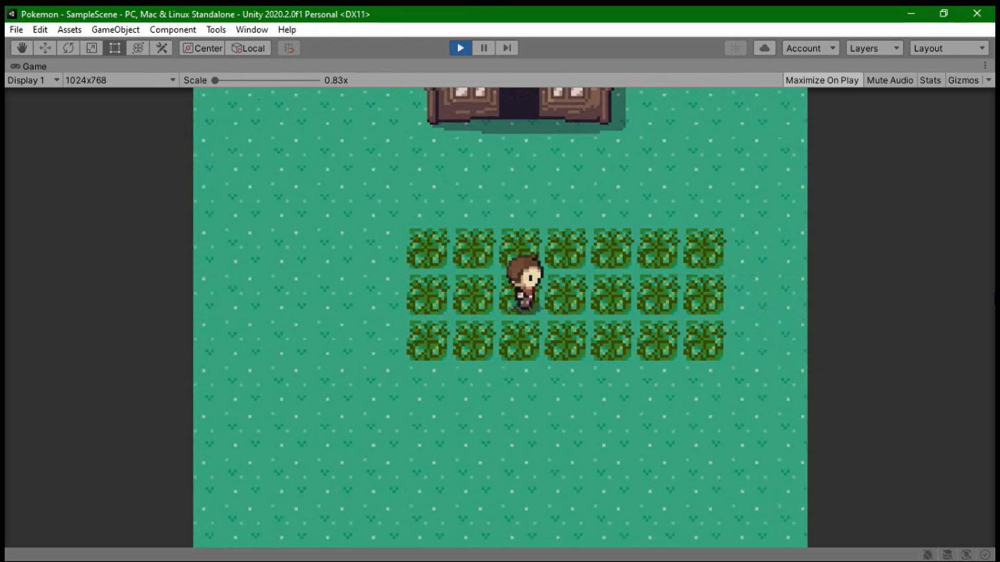
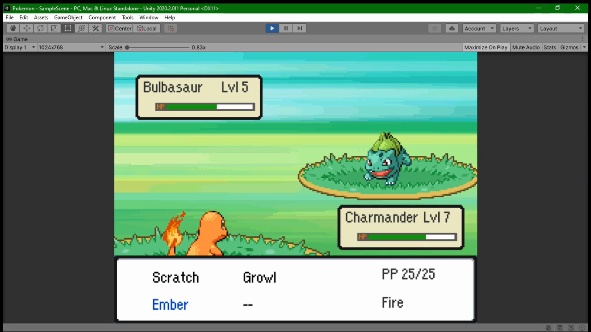

# Pokemon
### A clone of Nintendo's very popular Pokemon Game Series using Unity Game Engine. 
I have tried to recreate the original game design and feel in my project as a big fan while also trying to make my code architecture scalable and modular.

# ScreenShots

 &nbsp&nbsp&nbsp&nbsp

 &nbsp&nbsp&nbsp&nbsp

### Design Patterns used for the development
* **Observer Pattern**
* **State Machine**

### Demo Link
You can have a look at the current stage of the project here below:  
https://youtu.be/iaCEjuJqn4Y

# Class Diagram

 &nbsp&nbsp&nbsp&nbsp

